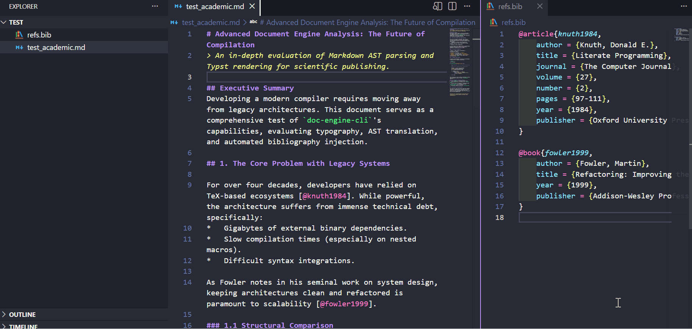

<div align="center">

# doc-engine-cli

**Zero-config Markdown → PDF documentation engine**

[](https://opensource.org/licenses/MIT)
[](https://www.python.org/downloads/)
[](https://pypi.org/project/doc-engine-cli/)
[](https://pepy.tech/projects/doc-engine-cli)
[](https://typst.app/)
[](https://github.com/psf/black)

Transform any `README.md` into a premium, print-ready PDF report — no configuration, no templates, no LaTeX.

<br>

<br>

```
pipx install doc-engine-cli
```

---

</div>

## Overview

**doc-engine-cli** is a developer-first CLI tool that converts Markdown files into professionally styled PDF documents using [Typst](https://typst.app/) as its rendering backend. It is designed for teams and individual developers who need high-quality documentation artifacts without the complexity of LaTeX or manual typesetting.

The tool auto-detects your `README.md`, extracts metadata from Git, and produces an IEEE-inspired technical document — complete with cover page, table of contents, and premium typography — in a single command.

```bash
doc-engine build
```

That's it. Zero configuration required.

---

## Features

| Feature | Description |
|---|---|
| **Zero-Config** | Auto-detects `README.md`, Git author, and document title. No setup files needed. |
| **Five Templates** | Academic, modern, minimal, technical, and book layouts, each with a configurable accent color. |
| **Error Checking** | Reports source problems with line and column before compiling. A `--dry-run` mode runs the check on its own. |
| **Premium Typography** | Inter font family with fallback chain, justified text, and optimized line spacing. |
| **Code-Centric** | Syntax-highlighted code blocks with Cascadia Code font and GitHub-style backgrounds. |
| **Pure Python** | No external binaries required (no Pandoc, no LaTeX). Ships as a single `pip install`. |
| **Cross-Platform** | Works on Windows, macOS, and Linux with Python 3.10+. |

---

## 🎓 Academic Features (v0.1.2+)

`doc-engine-cli` ships with a premium scientific layout (using Linux Libertine and Inter font-families) and **Zero-Config Bibliography** handling. 

To add an IEEE-styled bibliography to your PDF:
1. Create a `refs.bib`, `references.bib`, or `bibliography.bib` file in your repository.
2. In your `README.md`, cite using standard syntax: `[@citation-key]`.

When you run `doc-engine build`, the CLI will automatically detect your `.bib` file, securely bind it to the sandbox, and inject a formatted References page at the end of the document.

---

## Quick Start

### Installation

```bash
pipx install doc-engine-cli
```
*(If you don't have `pipx`, you can install it via `pip install pipx`)*

### Generate Your First PDF

Navigate to any project directory containing a `README.md` and run:

```bash
doc-engine build
```

The tool will:

1. Auto-detect `README.md` in the current directory
2. Extract the document title from the first `# heading`
3. Read your Git `user.name` for the author field
4. Generate a `README_doc.pdf` with cover page, ToC, and formatted content

### Explicit Options

```bash
doc-engine build path/to/file.md -o output.pdf -t "Custom Title" -a "Author Name"
```

---

## Usage

### Commands

```
doc-engine build [INPUT_FILE]   Convert a Markdown file into a PDF
doc-engine info                 Show version, repository, and templates
doc-engine --version            Print the version and exit
doc-engine --help               Show all commands and flags
```

### `build` flags

| Flag | Default | Description |
|---|---|---|
| `INPUT_FILE` | auto-detect `README.md` | Path to the Markdown file to convert. |
| `-o, --output` | `<input>_doc.pdf` | Output PDF path. |
| `-t, --title` | first `# heading` | Document title override. |
| `-a, --author` | `git config user.name` | Author name override. |
| `--template` | `academic` | Layout to render with: `academic`, `modern`, `minimal`, `technical`, `book`. |
| `--accent` | template default | Accent color as a hex value (`#2563eb`) or a name (`blue`, `teal`, `rose`, ...). |
| `--bib` | auto-detect `refs.bib` | Path to a custom `.bib` file for the bibliography. |
| `--no-branding` | off | Hide the `doc-engine` attribution from the PDF. |
| `--dry-run` | off | Check the Markdown for errors and exit without writing a PDF. |
| `--open` | off | Open the PDF after it is generated. |

### Examples

**Basic — zero-config mode:**
```bash
cd my-project
doc-engine build
# → Generates README_doc.pdf
```

**Specify input and output:**
```bash
doc-engine build CONTRIBUTING.md -o contributing_guide.pdf
```

**Override metadata:**
```bash
doc-engine build -t "API Reference v2.0" -a "Engineering Team"
```

**Pick a template and accent color:**
```bash
doc-engine build --template modern --accent teal
doc-engine build --template technical --accent "#7c3aed"
```

**Check for errors before building:**
```bash
doc-engine build --dry-run
```

**Drop the engine attribution from the PDF:**
```bash
doc-engine build --no-branding
```

**Generate and open immediately:**
```bash
doc-engine build --open
```

**Use as Python module:**
```bash
python -m doc_engine build README.md
```

---

## Templates

`doc-engine` ships with five layouts. Switch with `--template <name>`, and recolor any of them with `--accent`.

| Template | Look |
|---|---|
| `academic` | Serif IEEE-style report with cover page, table of contents, and running headers. The default. |
| `modern` | Clean sans-serif layout with generous spacing and a left-aligned cover. |
| `minimal` | No cover or table of contents — a compact title block, then straight into the content. |
| `technical` | Bold layout with a filled accent banner and section markers. Good for engineering docs. |
| `book` | Classic centered title page with chapter-style section breaks. |

```bash
doc-engine build --template book
doc-engine build --template modern --accent rose
```

Accent colors take a hex value (`#0ea5e9`) or one of these names: `blue`, `sky`, `indigo`, `violet`, `purple`, `red`, `rose`, `orange`, `amber`, `green`, `emerald`, `teal`, `slate`, `black`.

---

## Checking for Errors

Before compiling, `doc-engine` scans the Markdown for problems and reports them with the exact line and column, so you can jump straight to the fix:

```
README.md:42:8: error: link URL must not be empty
README.md:51:1: warning: image source is empty
```

Errors stop the build; warnings don't. Use `--dry-run` to run the check on its own without producing a PDF — handy in CI:

```bash
doc-engine build --dry-run
```

---

## Architecture

```
                    ┌─────────────┐
                    │  README.md  │
                    └──────┬──────┘
                           │
                    ┌──────▼──────┐
                    │   CLI Layer  │  click + rich
                    │  (cli.py)    │  arg parsing, git detection
                    └──────┬──────┘
                           │
              ┌────────────┼────────────┐
              │                         │
       ┌──────▼──────┐          ┌───────▼──────┐
       │  Converter   │          │   Compiler   │
       │(converter.py)│          │(compiler.py) │
       │              │          │              │
       │ Markdown AST │          │  Typst → PDF │
       │  → Typst     │          │  via typst-py│
       └──────┬──────┘          └───────┬──────┘
              │                         │
              │    ┌──────────────┐     │
              └────► templates/   ◄─────┘
                   │   *.typ      │
                   └──────┬──────┘
                          │
                   ┌──────▼──────┐
                   │  output.pdf  │
                   └─────────────┘
```

### Pipeline

| Stage | Module | Responsibility |
|---|---|---|
| **1. Input Resolution** | `cli.py` | Locate Markdown file, detect Git metadata |
| **2. Source Checking** | `linter.py` | Report empty links and unclosed fences with line/column |
| **3. Markdown Parsing** | `converter.py` | Parse Markdown AST via `mistune`, emit Typst markup |
| **4. Template Injection** | `compiler.py` | Merge converted content with the selected template |
| **5. PDF Compilation** | `compiler.py` | Compile via `typst` Python bindings |

---

## How It Works

### Markdown → Typst Conversion

The converter module parses Markdown using [`mistune`](https://github.com/lepture/mistune) and generates equivalent Typst markup:

| Markdown | Typst Output |
|---|---|
| `# Heading` | `= Heading` |
| `**bold**` | `*bold*` |
| `*italic*` | `_italic_` |
| `` `code` `` | `` `code` `` |
| `[text](url)` | `#link("url")[text]` |
| `- item` | `- item` |
| `1. item` | `+ item` |
| `> blockquote` | `#block(...)` |
| `---` | `#line(...)` |

Special characters (`#`, `$`, `@`, `*`, `_`, etc.) are automatically escaped to prevent Typst interpretation.

### PDF Templates

Each template lives in `doc_engine/templates/` and exposes the same `setup_doc` entry point, so the compiler can swap between them with `--template`. The default `academic` template provides:

- **Cover page** with title, author, and date
- **Table of contents** with depth-3 navigation
- **Running headers** with document title and author
- **Page footer** with page numbers and engine attribution
- **Code blocks** with rounded corners and subtle borders
- **Heading hierarchy** with accent-colored H2 sections

The other templates (`modern`, `minimal`, `technical`, `book`) keep the same content but change the fonts, layout, and cover. The accent color is injected at compile time, so `--accent` recolors any of them.

---

## Project Structure

```
doc-engine-cli/
├── doc_engine/
│   ├── __init__.py          # Package version
│   ├── __main__.py          # python -m doc_engine entrypoint
│   ├── cli.py               # Click-based CLI + Git detection
│   ├── converter.py         # Markdown → Typst transpiler
│   ├── compiler.py          # Typst → PDF compilation engine
│   ├── linter.py            # Source checks (line/column reporting)
│   └── templates/
│       ├── academic.typ     # Default IEEE-style report
│       ├── modern.typ       # Clean sans-serif layout
│       ├── minimal.typ      # Compact, no cover page
│       ├── technical.typ    # Accent banner + section markers
│       └── book.typ         # Centered title page, chapter breaks
├── tests/
│   ├── __init__.py
│   ├── test_converter.py    # Unit tests for the converter
│   ├── test_linter.py       # Unit tests for the linter
│   └── test_cli.py          # CLI and template/accent tests
├── pyproject.toml            # Package configuration + dependencies
├── LICENSE                   # MIT License
├── .gitignore
└── README.md
```

---

## Dependencies

| Package | Purpose | License |
|---|---|---|
| [`click`](https://click.palletsprojects.com/) | CLI framework | BSD-3 |
| [`rich`](https://github.com/Textualize/rich) | Terminal formatting and progress indicators | MIT |
| [`mistune`](https://github.com/lepture/mistune) | Markdown parser (pure Python) | BSD-3 |
| [`typst`](https://github.com/messense/typst-py) | Typst compiler bindings | Apache-2.0 |

All dependencies are pure Python — no external binaries (Pandoc, LaTeX, etc.) are required.

---

## Development

### Setup

```bash
git clone https://github.com/leonardosalasd/doc-engine-cli.git
cd doc-engine-cli
pip install -e ".[dev]"
```

### Run Tests

```bash
python -m pytest tests/ -v
```

### Project Commands

```bash
# Generate PDF from this project's README
python -m doc_engine build

# Run with verbose error output
python -m doc_engine build README.md -o docs_output.pdf
```

---

## Docker

A container image is published to GitHub Container Registry on every release. Mount your project into `/workspace` and run `build` as usual:

```bash
docker run --rm -v "$PWD:/workspace" ghcr.io/leonardosalasd/doc-engine-cli build
```

The entrypoint is `doc-engine`, so you can pass any command or flag:

```bash
docker run --rm -v "$PWD:/workspace" ghcr.io/leonardosalasd/doc-engine-cli build --template modern --accent teal
```

---

## Supported Markdown Elements

- [x] Headings (H1–H6)
- [x] Bold, italic, strikethrough
- [x] Inline code and fenced code blocks (with language hints)
- [x] Links
- [x] Ordered and unordered lists
- [x] Nested lists
- [x] Blockquotes
- [x] Tables
- [x] Horizontal rules
- [x] Line breaks (`<br>`)
- [ ] Images (rendered as alt-text; remote images not embedded)
- [ ] Footnotes
- [ ] Math blocks

---

## Roadmap

- [x] Template selection via `--template` flag
- [x] Configurable accent color via `--accent`
- [x] Source error checking with line/column and `--dry-run`
- [ ] User-supplied template files (point `--template` at a path)
- [ ] Multi-file documentation merge
- [ ] Image downloading and embedding for remote URLs
- [ ] YAML front-matter support for metadata override
- [ ] PDF/A compliance for archival

---

## Contributing

Contributions are welcome. Please follow these guidelines:

1. Fork the repository
2. Create a feature branch (`git checkout -b feature/your-feature`)
3. Write tests for new functionality
4. Ensure all tests pass (`python -m pytest tests/ -v`)
5. Submit a pull request

---

## License

This project is licensed under the [MIT License](LICENSE).

---

<div align="center">

**Built with [Typst](https://typst.app/) · Parsed with [mistune](https://github.com/lepture/mistune) · Styled with [Rich](https://github.com/Textualize/rich)**

</div>