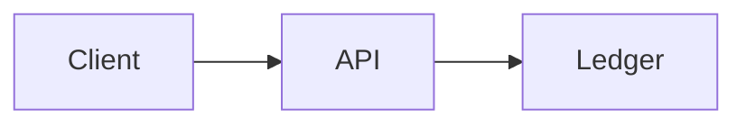

<div align="center">

# doc-engine-cli

**Zero-config Markdown → PDF documentation engine**

[](https://opensource.org/licenses/MIT)
[](https://www.python.org/downloads/)
[](https://pypi.org/project/doc-engine-cli/)
[](https://pepy.tech/projects/doc-engine-cli)
[](https://typst.app/)
[](https://github.com/leonardosalasd/doc-engine-cli/actions/workflows/tests.yml)

Transform any `README.md` into a premium, print-ready PDF report — no configuration, no templates, no LaTeX.

<br>

<br>

```
pipx install doc-engine-cli
```

---

</div>

> [!NOTE]
> ### v2.0.0 is finished and looking for testers
>
> All of v2.0.0 is written and merged here — diagrams, math, multi-file
> documents, seven layouts, page sizes, and the rest. It is **not on PyPI yet**,
> because I would rather find the rough edges before publishing than after.
> `pipx install doc-engine-cli` still gives you the stable **1.1.1**.
>
> **Try it and help me break it.** This installs into a throwaway environment,
> so whatever you already have stays exactly where it is:
>
> ```bash
> git clone https://github.com/leonardosalasd/doc-engine-cli.git
> cd doc-engine-cli
> python -m venv .venv
> source .venv/bin/activate        # Windows: .venv\Scripts\activate
> pip install -e .
> python -m doc_engine --version   # should say 2.0.0
> ```
>
> Use `python -m doc_engine` rather than the bare `doc-engine` command while
> testing. If you already have a copy installed, your shell may keep resolving
> `doc-engine` to that older one even inside the virtualenv, and you would end
> up testing the wrong version without noticing. Running it through `python -m`
> always uses the environment you are standing in. (`hash -r` usually fixes the
> shell too, and `which doc-engine` tells you which one you are about to run.)
>
> Then point it at a document — your own, or `examples/showcase.md` in the
> checkout. When you are done, `deactivate` puts everything back.
>
> Everything in this README describes v2.0.0 and works on that checkout. If
> something misbehaves, an [issue](https://github.com/leonardosalasd/doc-engine-cli/issues/new)
> or a note in [Discussions](https://github.com/leonardosalasd/doc-engine-cli/discussions)
> is genuinely useful — that feedback is what decides when this ships.
>
> The release follows once it has been through real documents on real machines.

## Overview

**doc-engine-cli** is a developer-first CLI tool that converts Markdown files into professionally styled PDF documents using [Typst](https://typst.app/) as its rendering backend. It is designed for teams and individual developers who need high-quality documentation artifacts without the complexity of LaTeX or manual typesetting.

The tool auto-detects your `README.md`, extracts metadata from Git, and produces an IEEE-inspired technical document — complete with cover page, table of contents, and premium typography — in a single command.

```bash
doc-engine build
```

That's it. Zero configuration required.

---

## Features

| Feature | Description |
|---|---|
| **Zero-Config** | Auto-detects `README.md`, Git author, and document title. No setup files needed. |
| **Seven Templates** | Academic, article, book, minimal, modern, report, and technical layouts, each with a configurable accent color. Point `--template` at your own `.typ` file to go further. |
| **Front Matter** | An optional `---` metadata block sets the title, subtitle, author, template, and accent right inside the file. |
| **Watch Mode** | `--watch` rebuilds the PDF every time you save the source. |
| **Diagrams** | ` ```mermaid ` and ` ```svg ` blocks are rendered as real diagrams, in pure Python — no Node, no headless browser. |
| **Alerts** | `> [!NOTE]` and friends render as coloured callouts, the way GitHub shows them. |
| **Math** | LaTeX math, inline with `$…$` and display with `$$…$$`, translated into native Typst math. |
| **Multi-File** | A `doc-engine.md` manifest builds one PDF from many files, diagrams, figures, and a bibliography. |
| **Page Sizes** | A4 by default, plus A3–A6, ISO/JIS B5, and US letter, legal, and tabloid. |
| **Project Config** | A `.doc-engine.toml` keeps a team's defaults out of every document. |
| **Rich Markdown** | Embeds local images, renders GitHub task lists as real checkboxes, and turns `[^1]` footnotes into native Typst footnotes. |
| **Error Checking** | Reports source problems with line and column before compiling. A `--dry-run` mode runs the check on its own. |
| **Non-Destructive** | Never overwrites an existing PDF — writes `report (1).pdf`, `report (2).pdf`, … unless you pass `--force`. |
| **Premium Typography** | Font stacks that end in a font Typst ships, so a document looks the same in a bare container as on a laptop. |
| **Pure Python** | No external binaries required (no Pandoc, no LaTeX). Ships as a single `pip install`. |
| **Cross-Platform** | Works on Windows, macOS, and Linux with Python 3.10+. |

---

## Academic Writing

Cite with the usual `[@citation-key]` syntax and drop a `refs.bib`,
`references.bib`, or `bibliography.bib` next to your document. It is picked up
automatically and rendered as an IEEE-styled references section:

```markdown
As shown in [@smith2020], results vary.
```

Point `--bib` at a different file, or name one in front matter, to override the
search. Combine it with the `academic`, `article`, or `report` layout and LaTeX
math for a paper that needs no LaTeX toolchain.

---

## Quick Start

### Installation

```bash
pipx install doc-engine-cli
```
*(If you don't have `pipx`, you can install it via `pip install pipx`)*

### Generate Your First PDF

Navigate to any project directory containing a `README.md` and run:

```bash
doc-engine build
```

The tool will:

1. Auto-detect `README.md` in the current directory
2. Extract the document title from the first `# heading`
3. Read your Git `user.name` for the author field
4. Generate a `README_doc.pdf` with cover page, ToC, and formatted content

### Explicit Options

```bash
doc-engine build path/to/file.md -o output.pdf -t "Custom Title" -a "Author Name"
```

---

## Usage

<div align="center">

<br>
<em>Switching templates, recoloring the accent, and checking a file for errors.</em>
</div>

### Commands

```
doc-engine build [INPUT_FILE]   Convert a Markdown file into a PDF
doc-engine info                 Show version, repository, and templates
doc-engine --version            Print the version and exit
doc-engine --help               Show all commands and flags
```

### `build` flags

| Flag | Default | Description |
|---|---|---|
| `INPUT_FILE` | auto-detect `README.md` | Path to the Markdown file to convert. |
| `-o, --output` | `<input>_doc.pdf` | Output PDF path. |
| `-t, --title` | first `# heading` | Document title override. |
| `-s, --subtitle` | none | Subtitle shown under the title on the cover. |
| `-a, --author` | `git config user.name` | Author name override. |
| `--date` | today | Date shown on the cover. |
| `--template` | `academic` | A built-in layout (`academic`, `article`, `book`, `minimal`, `modern`, `report`, `technical`) or a path to your own `.typ` file. |
| `--accent` | template default | Accent color as a hex value (`#2563eb`) or a name (`blue`, `teal`, `rose`, ...). |
| `--paper` | `a4` | Page size: `a3`–`a6`, `iso-b5`, `jis-b5`, `us-letter`, `us-legal`, `us-tabloid`. |
| `--bib` | auto-detect `refs.bib` | Path to a custom `.bib` file for the bibliography. |
| `--pdf-standard` | off | Write an archival PDF/A file: `a-2b` or `a-3b`. |
| `--code-theme` | Typst default | Syntax highlighting theme: `github`, `solarized`, `monochrome`, or a path to a `.tmTheme`. |
| `--tall-images` | `fit` | What to do with a picture taller than a page: `fit` scales it onto one page, `split` cuts it across several. |
| `--fetch-images` | off | Download images linked by URL instead of rendering their alt text. |
| `--no-branding` | off | Hide the `doc-engine` attribution from the PDF. |
| `--dry-run` | off | Check the Markdown for errors and exit without writing a PDF. |
| `-w, --watch` | off | Rebuild automatically whenever the source file changes. |
| `-f, --force` | off | Overwrite the output file instead of writing a numbered copy. |
| `--open` | off | Open the PDF after it is generated. |

Any flag can also be set in the front matter (see below); a flag on the command line always wins.

### Examples

**Basic — zero-config mode:**
```bash
cd my-project
doc-engine build
# → Generates README_doc.pdf
```

**Specify input and output:**
```bash
doc-engine build CONTRIBUTING.md -o contributing_guide.pdf
```

**Override metadata:**
```bash
doc-engine build -t "API Reference v2.0" -a "Engineering Team"
```

**Pick a template and accent color:**
```bash
doc-engine build --template modern --accent teal
doc-engine build --template technical --accent "#7c3aed"
```

**Check for errors before building:**
```bash
doc-engine build --dry-run
```

**Drop the engine attribution from the PDF:**
```bash
doc-engine build --no-branding
```

**Generate and open immediately:**
```bash
doc-engine build --open
```

**Rebuild on every save:**
```bash
doc-engine build --watch
```

**Use as Python module:**
```bash
python -m doc_engine build README.md
```

---

## Front Matter

Any Markdown file can open with a `---` block to carry its own settings, so the
document renders the same way for everyone — no flags to remember:

```markdown
---
title: Payments API
subtitle: Integration Guide
author: Platform Team
template: technical
accent: teal
---

# Payments API

...
```

Supported keys: `title`, `subtitle`, `author`, `date`, `template`, `accent`,
`paper`, and `bib`. A flag passed on the command line overrides the matching front-matter key,
which in turn overrides the auto-detected value.

---

## Watch Mode

Pass `--watch` to keep `doc-engine` running and rebuild the PDF whenever you save
the source. It's the fastest way to tweak a template or accent and see the result:

<div align="center">

<br>
<em>Every file the manifest names is watched, and a save rebuilds the whole document.</em>
</div>

```bash
doc-engine build --watch --template modern --accent teal
```

The output path is chosen once when watch starts, then rewritten in place on each
change. Press `Ctrl+C` to stop.

---

## Diagrams

Fenced blocks tagged `mermaid` or `svg` become pictures instead of code:

````markdown

```mermaid
flowchart LR
    Client --> API --> Ledger
```
````

Mermaid is rendered through an embedded JavaScript engine, so there is no Node
install and no headless browser — it stays a plain `pip install`. A `svg` block
is passed straight through, since Typst draws SVG natively.

If a diagram has a syntax error, the build stops and reports Mermaid's own
message rather than producing a broken document.

---

## Math

LaTeX math is translated into native Typst math, inline with `$…$` and as a
display block with `$$…$$`:

```markdown
The quadratic formula is $x = \frac{-b \pm \sqrt{b^2-4ac}}{2a}$.

$$
P(A \mid B) = \frac{P(B \mid A)\,P(A)}{P(B)}
$$
```

Greek letters, relations, fractions, roots, sub- and superscripts, font
commands, matrices, and `cases` are covered. Anything unrecognized passes
through with its backslash removed, which lands on the right Typst symbol most
of the time.

A `$` that is not math stays untouched, so prices and shell variables survive:
`$10`, `$HOME`, and `export $PATH` all render as written.

---

## Alerts

A blockquote that opens with a marker becomes a coloured callout, matching what
GitHub shows on the page:

```markdown
> [!NOTE]
> Useful information worth knowing.

> [!WARNING]
> Something that needs attention.
```

`NOTE`, `TIP`, `IMPORTANT`, `WARNING`, and `CAUTION` are all recognized. A
blockquote without a marker stays an ordinary quote.

---

## Code Themes

Code blocks are highlighted with Typst's own colours by default. `--code-theme`
swaps that for something else:

```bash
doc-engine build --code-theme github
doc-engine build --code-theme monochrome     # for printing in black and white
```

| Theme | Look |
|---|---|
| `github` | GitHub's light palette |
| `solarized` | Solarized light |
| `monochrome` | Greys only — keeps code legible on a black-and-white printer |

Any TextMate `.tmTheme` file works too, so a theme from your editor can be
pointed at directly:

```bash
doc-engine build --code-theme ~/themes/my-editor.tmTheme
```

---

## Cross-References

Inside a manifest build, a link from one included file to another becomes a jump
within the PDF rather than a link to a file the reader does not have:

```markdown
For the full picture see [the data model](model.md).
```

That resolves to the place where `model.md` was merged in. Links to anything
outside the build — a URL, a file that is not part of the manifest — are left
exactly as they are.


---

## Multi-File Documents

A project that has outgrown a single file lists its parts in `doc-engine.md`,
using ordinary Markdown links so the manifest still reads as a table of
contents on GitHub:

```markdown
---
title: Payments Platform
subtitle: Engineering Handbook
template: report
---

- [Overview](doc/overview.md)
- [Architecture](diagrams/architecture.mmd)
- [Schema](img/schema.svg)
- [References](bib/references.bib)
```

Then just build:

```bash
doc-engine build
```

<div align="center">

<br>
<em>One manifest, one command: sections, a diagram, a figure, and a bibliography.</em>
</div>

Each entry is handled by what it is:

| Entry | What happens |
|---|---|
| `.md` | Appended as a section, headings intact |
| `.mmd`, `.mermaid` | Rendered as a diagram at that point |
| `.png`, `.svg`, `.jpg`, … | Placed as a captioned figure |
| `.bib` | Registered as the bibliography for the document |

Paths resolve against the manifest's folder, and every included file resolves
its own images relative to itself — so a file builds the same way alone as it
does inside the manifest. `--watch` follows every file the manifest names.

---

## Project Configuration

Team defaults belong in a `.doc-engine.toml` next to the project, not repeated
in every document:

```toml
[doc-engine]
template = "report"
accent = "teal"
paper = "us-letter"
```

A `[tool.doc-engine]` table in `pyproject.toml` works the same way. Precedence
runs command-line flag, then front matter, then this file.

Every key it understands:

| Key | Values |
|---|---|
| `template` | A built-in layout name, or a path to a `.typ` file |
| `paper` | `a3`–`a6`, `iso-b5`, `jis-b5`, `us-letter`, `us-legal`, `us-tabloid` |
| `accent` | A hex value or a colour name |
| `author` | Author name, used instead of the Git user |
| `bib` | Path to a `.bib` file |
| `branding` | `false` hides the `doc-engine` attribution |
| `code_theme` | `github`, `solarized`, `monochrome`, or a path to a `.tmTheme` |
| `pdf_standard` | `a-2b` or `a-3b` |
| `tall_images` | `fit` or `split` |
| `fetch_images` | `true` downloads images linked by URL |

Anything else in the table is ignored, so a typo cannot quietly change how a
document is built.

---

## Large Images

A picture that does not fit the text block is scaled down until it does, so
nothing is ever clipped. For a tall diagram — a top-down flowchart, a long
schema — scaling it onto one page can leave it unreadable, so it can be cut
across pages at full size instead:

```bash
doc-engine build --tall-images split
```

---

## Archival PDFs

For documents that have to stay readable for decades:

```bash
doc-engine build --pdf-standard a-2b
```

`a-3b` is also accepted, which additionally allows embedded attachments.

---

## Templates

`doc-engine` ships with seven layouts. Switch with `--template <name>`, and recolor any of them with `--accent`.

| Template | Look |
|---|---|
| `academic` | Serif IEEE-style report with cover page, table of contents, and running headers. The default. |
| `modern` | Clean sans-serif layout with generous spacing and a left-aligned cover. |
| `minimal` | No cover or table of contents — a compact title block, then straight into the content. |
| `technical` | Bold layout with a filled accent banner and section markers. Good for engineering docs. |
| `book` | Classic centered title page with chapter-style section breaks. |
| `article` | A LaTeX paper: New Computer Modern, numbered sections, title block on page one. |
| `report` | Roomy and easy on the eyes — 12pt on generous leading, wide margins, lots of air. |

```bash
doc-engine build --template book
doc-engine build --template modern --accent rose
```

Accent colors take a hex value (`#0ea5e9`) or one of these names: `blue`, `sky`, `indigo`, `violet`, `purple`, `red`, `rose`, `orange`, `amber`, `green`, `emerald`, `teal`, `slate`, `black`.

### Bring your own template

`--template` also accepts a path to a `.typ` file, so you can ship a house style
without forking the project:

```bash
doc-engine build --template ./corporate.typ
```

The quickest way to start is to copy one of the files in
[`doc_engine/templates/`](doc_engine/templates) and edit it. A template exposes a
single `setup_doc` entry point, and the compiler passes it the document metadata:

```typ
#let setup_doc(
  title: "",
  subtitle: "",
  author: "Anonymous",
  date: datetime.today().display(),
  bibliography_file: none,
  accent: none,
  branding: true,
  version: "",
  body,
) = { ... }
```

---

## Checking for Errors

Before compiling, `doc-engine` scans the Markdown for problems and reports them with the exact line and column, so you can jump straight to the fix:

```
README.md:42:8: error: link URL must not be empty
README.md:51:1: warning: image source is empty
```

Errors stop the build; warnings don't. Use `--dry-run` to run the check on its own without producing a PDF — handy in CI:

```bash
doc-engine build --dry-run
```

---

## Architecture

```
                    ┌─────────────┐
                    │  README.md  │
                    └──────┬──────┘
                           │
                    ┌──────▼──────┐
                    │   CLI Layer  │  click + rich
                    │  (cli.py)    │  arg parsing, git detection
                    └──────┬──────┘
                           │
              ┌────────────┼────────────┐
              │                         │
       ┌──────▼──────┐          ┌───────▼──────┐
       │  Converter   │          │   Compiler   │
       │(converter.py)│          │(compiler.py) │
       │              │          │              │
       │ Markdown AST │          │  Typst → PDF │
       │  → Typst     │          │  via typst-py│
       └──────┬──────┘          └───────┬──────┘
              │                         │
              │    ┌──────────────┐     │
              └────► templates/   ◄─────┘
                   │   *.typ      │
                   └──────┬──────┘
                          │
                   ┌──────▼──────┐
                   │  output.pdf  │
                   └─────────────┘
```

### Pipeline

| Stage | Module | Responsibility |
|---|---|---|
| **1. Input Resolution** | `cli.py` | Locate Markdown file, detect Git metadata |
| **2. Source Checking** | `linter.py` | Report empty links and unclosed fences with line/column |
| **3. Markdown Parsing** | `converter.py` | Parse Markdown AST via `mistune`, emit Typst markup |
| **4. Template Injection** | `compiler.py` | Merge converted content with the selected template |
| **5. PDF Compilation** | `compiler.py` | Compile via `typst` Python bindings |

---

## How It Works

### Markdown → Typst Conversion

The converter module parses Markdown using [`mistune`](https://github.com/lepture/mistune) and generates equivalent Typst markup:

| Markdown | Typst Output |
|---|---|
| `# Heading` | `= Heading` |
| `**bold**` | `*bold*` |
| `*italic*` | `_italic_` |
| `` `code` `` | `` `code` `` |
| `[text](url)` | `#link("url")[text]` |
| `- item` | `- item` |
| `1. item` | `+ item` |
| `- [x] task` | rendered checkbox |
| `text[^1]` | `#footnote[...]` |
| `` | `#image("local.png")` |
| `> blockquote` | `#block(...)` |
| `---` | `#line(...)` |

Special characters (`#`, `$`, `@`, `*`, `_`, etc.) are automatically escaped to prevent Typst interpretation.

### PDF Templates

Each template lives in `doc_engine/templates/` and exposes the same `setup_doc` entry point, so the compiler can swap between them with `--template`. The default `academic` template provides:

- **Cover page** with title, author, and date
- **Table of contents** with depth-3 navigation
- **Running headers** with document title and author
- **Page footer** with page numbers and engine attribution
- **Code blocks** with rounded corners and subtle borders
- **Heading hierarchy** with accent-colored H2 sections

The other templates (`modern`, `minimal`, `technical`, `book`) keep the same content but change the fonts, layout, and cover. The accent color is injected at compile time, so `--accent` recolors any of them.

---

## Project Structure

```
doc-engine-cli/
├── doc_engine/
│   ├── __init__.py          # Package version
│   ├── __main__.py          # python -m doc_engine entrypoint
│   ├── cli.py               # Click-based CLI + Git detection
│   ├── help.py              # Rich help screens
│   ├── config.py            # .doc-engine.toml project settings
│   ├── settings.py          # flag / front matter / project precedence
│   ├── frontmatter.py       # Leading --- metadata block
│   ├── manifest.py          # doc-engine.md multi-file builds
│   ├── converter.py         # Markdown → Typst transpiler
│   ├── latex.py             # LaTeX math → Typst math
│   ├── diagrams.py          # Mermaid and SVG blocks
│   ├── images.py            # Cutting pictures taller than a page
│   ├── remote.py            # Downloading linked images
│   ├── compiler.py          # Typst → PDF compilation engine
│   ├── linter.py            # Source checks (line/column reporting)
│   └── templates/
│       ├── academic.typ     # Default IEEE-style report
│       ├── article.typ      # LaTeX paper, numbered sections
│       ├── report.typ       # Roomy and legible
│       ├── modern.typ       # Clean sans-serif layout
│       ├── minimal.typ      # Compact, no cover page
│       ├── technical.typ    # Accent banner + section markers
│       └── book.typ         # Centered title page, chapter breaks
│   └── themes/
│       ├── github.tmTheme    # Syntax highlighting themes
│       ├── solarized.tmTheme
│       └── monochrome.tmTheme
├── tests/                    # 181 tests across every module
├── pyproject.toml            # Package configuration + dependencies
├── LICENSE                   # MIT License
├── .gitignore
└── README.md
```

---

## Dependencies

| Package | Purpose | License |
|---|---|---|
| [`click`](https://click.palletsprojects.com/) | CLI framework | BSD-3 |
| [`rich`](https://github.com/Textualize/rich) | Terminal formatting and progress indicators | MIT |
| [`mistune`](https://github.com/lepture/mistune) | Markdown parser (pure Python) | BSD-3 |
| [`typst`](https://github.com/messense/typst-py) | Typst compiler bindings | Apache-2.0 |
| [`mermaidx`](https://github.com/MohammadRaziei/mermaidx) | Mermaid rendering without Node | MIT |
| [`pillow`](https://github.com/python-pillow/Pillow) | Cutting pictures taller than a page | MIT-CMU |

All dependencies are pure Python — no external binaries (Pandoc, LaTeX, etc.) are required.

---

## Development

### Setup

```bash
git clone https://github.com/leonardosalasd/doc-engine-cli.git
cd doc-engine-cli
pip install -e ".[dev]"
```

### Run Tests

```bash
python -m pytest tests/ -v
```

### Project Commands

```bash
# Generate PDF from this project's README
python -m doc_engine build

# Run with verbose error output
python -m doc_engine build README.md -o docs_output.pdf
```

---

## Docker

A container image is published to GitHub Container Registry on every release. Mount your project into `/workspace` and run `build` as usual:

```bash
docker run --rm -v "$PWD:/workspace" ghcr.io/leonardosalasd/doc-engine-cli build
```

The entrypoint is `doc-engine`, so you can pass any command or flag:

```bash
docker run --rm -v "$PWD:/workspace" ghcr.io/leonardosalasd/doc-engine-cli build --template modern --accent teal
```

---

## Supported Markdown Elements

- [x] Headings (H1–H6)
- [x] Bold, italic, strikethrough
- [x] Inline code and fenced code blocks (with language hints)
- [x] Links
- [x] Ordered and unordered lists
- [x] Nested lists
- [x] Blockquotes
- [x] Tables
- [x] Horizontal rules
- [x] Line breaks (`<br>`)
- [x] Task lists (`- [x]` / `- [ ]`)
- [x] Footnotes (`[^1]`)
- [x] Local images, and remote ones with `--fetch-images`
- [x] Math blocks (LaTeX `$…$` and `$$…$$`)
- [x] Mermaid and SVG diagram blocks
- [x] GitHub alerts (`> [!NOTE]`, `[!TIP]`, `[!IMPORTANT]`, `[!WARNING]`, `[!CAUTION]`)

---

## Roadmap

- [x] Template selection via `--template` flag
- [x] Configurable accent color via `--accent`
- [x] Source error checking with line/column and `--dry-run`
- [x] User-supplied template files (point `--template` at a path)
- [x] YAML front-matter support for metadata override
- [x] Local image embedding
- [x] Watch mode for continuous rebuilds
- [x] Math expressions (LaTeX-style `$...$`)
- [x] Multi-file documentation merge
- [x] Mermaid diagram rendering
- [x] Image downloading and embedding for remote URLs
- [x] PDF/A compliance for archival
- [x] Page size selection
- [x] Project-level configuration file
- [x] Syntax highlighting themes for code blocks
- [x] Cross-references between documents

---

## Contributing

Contributions are welcome — bug reports, documentation fixes, new templates, and
features. The [contributing guide](CONTRIBUTING.md) covers setup, testing across
Python versions, code style, and how to add a template.

| | |
|---|---|
| [Contributing guide](CONTRIBUTING.md) | Setup, tests, style, pull requests |
| [Code of conduct](CODE_OF_CONDUCT.md) | Expected behavior in community spaces |
| [Security policy](SECURITY.md) | Reporting a vulnerability privately |
| [Support](SUPPORT.md) | Where to ask questions and report problems |

Questions belong in [Discussions](https://github.com/leonardosalasd/doc-engine-cli/discussions/categories/q-a);
bugs belong in [Issues](https://github.com/leonardosalasd/doc-engine-cli/issues).

---

## License

This project is licensed under the [MIT License](LICENSE).

---

<div align="center">

**Built with [Typst](https://typst.app/) · Parsed with [mistune](https://github.com/lepture/mistune) · Styled with [Rich](https://github.com/Textualize/rich)**

</div>