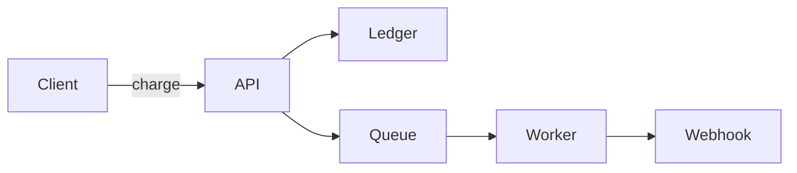

# Payments API

A short, self-contained guide that shows what `doc-engine` turns Markdown into:
front matter for metadata, diagrams, math, task lists, footnotes, tables, and
highlighted code — all from one file, with one command.

## Architecture

A fenced `mermaid` block becomes a real diagram, rendered without Node or a
browser:



## Getting started

Create a charge by posting an amount in the smallest currency unit[^minor]:

```bash
curl https://api.example.com/v1/charges \
  -H "Authorization: Bearer $API_KEY" \
  -d amount=4200 \
  -d currency=usd
```

Note that `$API_KEY` above stays a shell variable — a `$` only becomes math
when it wraps an expression, like $x^2$.

## Rate limiting

Requests are limited per account. The retry delay grows exponentially, where
$n$ is the attempt number:

$$
t_n = t_0 \cdot 2^{\,n} \qquad n \in \mathbb{N}
$$

The probability that a retry succeeds given the previous one failed:

$$
P(S_n \mid \lnot S_{n-1}) = \frac{P(\lnot S_{n-1} \mid S_n)\,P(S_n)}{P(\lnot S_{n-1})}
$$

## Status codes

| Code | Meaning | Retry? |
|---|---|---|
| `200` | Charge succeeded | No |
| `402` | Card declined | No |
| `429` | Rate limited | Yes, with backoff |
| `503` | Temporary outage | Yes |

## Release checklist

- [x] Idempotency keys on every write
- [x] Webhook signatures verified
- [ ] Sandbox tenants migrated
- [ ] Rotate the staging API key

> Charges are immutable once created. To adjust an amount, refund the original
> charge and create a new one.

[^minor]: For example, `4200` means **$42.00** in USD. Zero-decimal currencies
like JPY use the whole number.
